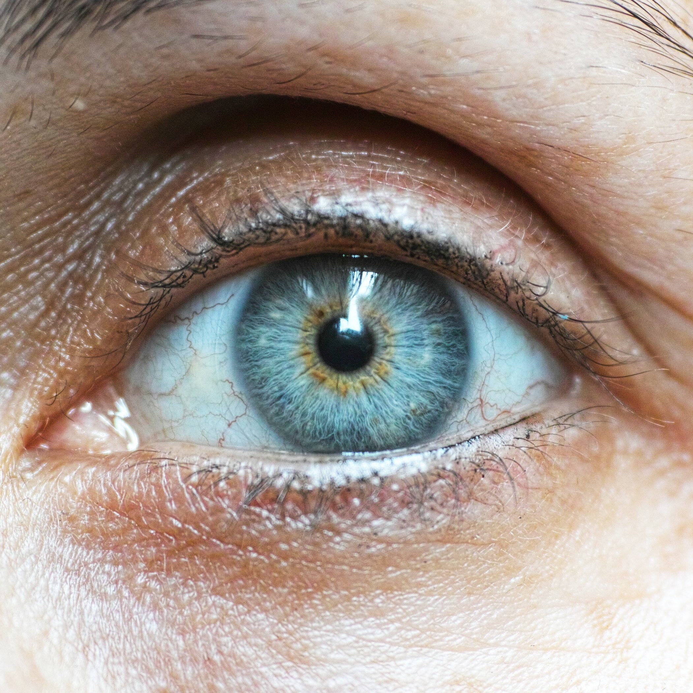
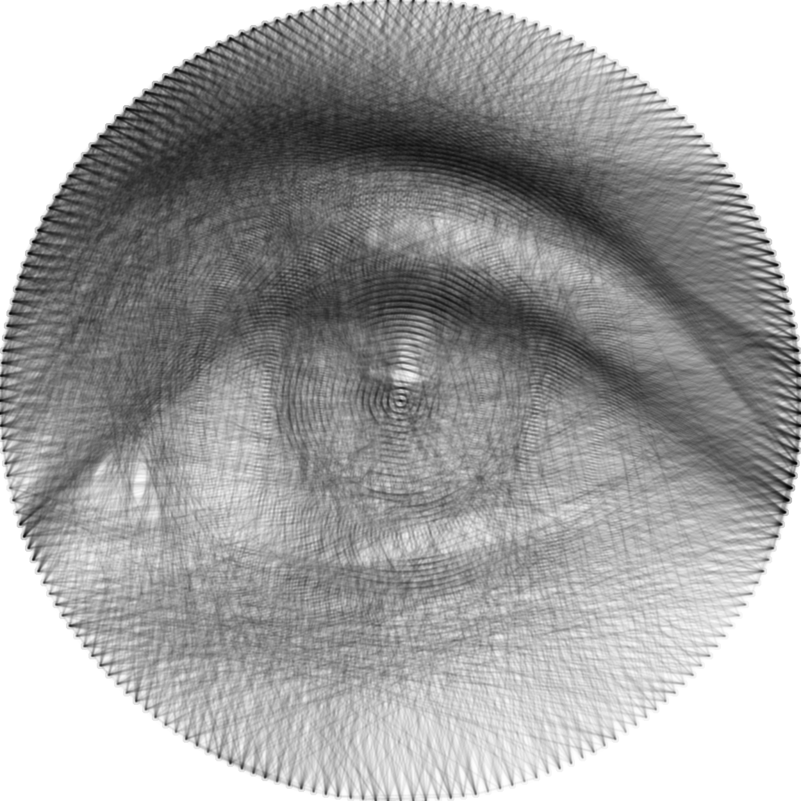

# Thread Art
**Generate some beautiful images out of black threads spun between nails on a circular or rectangular perimeter**

This work is heavily inspired by the SoME3-winner "The Mathematics of String Art" by channel *Virtually Passed*: https://youtu.be/WGccIFf6MF8

## Examples

Input Image:



Output Image:



Video:

<video><source src="./demo/pexels-engin-akyurt-result.mp4" /><p>[Click](./demo/pexels-engin-akyurt-result.mp4)</p></video>
Command:
```bash
cd ./src

Generate data (needs a lot of RAM!):
python thread-art.py ../demo/pexels-engin-akyurt.jpg --visualize-progress

Generate video from data:
python thread-art.py ../demo/pexels-engin-akyurt.jpg --load-nails ../demo/pexels-engin-akyurt-nails.txt --to-video ../demo/pexels-engin-akyurt-result.mp4 --video-length 10 --video-blend-target 5 --video-end 2.5
```


## How does it work?
- Main idea is from the video "The Mathematics of String Art" (see above).
- First, all possible nail-to-nail connections are generated and stored in memory (that's why you need a lot of it; 64GB or more recommended).
- Then a random starting point (randomly chosen nail) is selected.
- Next, a greedy algorithm tries to connect this nail with all other nails and selects the best connection.
- To determine how good a connection is, the resulting image will be compared to the target image. In each iteration, the algorithm selects the connection that results in the best improvement.
- The algorithm stops when there is no connection that improves the current result, i.e. all additional connections would result in a "worse" image.
